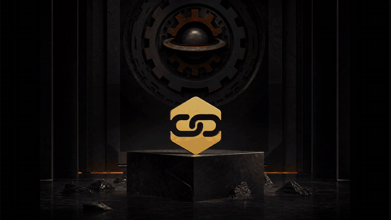

# Ordani Studios + TinyMe

**Little link. Big features.**

Short URL. Swap destinations. Track clicks.

[](https://zwin-ux.github.io/ordani-2026/)

## Demo



[Full MP4](docs/demo/tinyme-demo.mp4) · [GitHub Pages](https://zwin-ux.github.io/ordani-2026/) · [Showcase](https://zwin-ux.github.io/ordani-2026/showcase/)

Static Pages demo ships marketing, world, onboarding UI, console shell, and the domain STOP halt. Live short-link API is not on Pages.

---

## What's here

```
├── public/              Studio + TinyMe static site
│   ├── index.html       Ordani home
│   ├── tinyme.html      Product film → Make a link
│   ├── onboarding.html  First-link flow
│   ├── console.html     Operator console
│   └── showcase.html    Screens / gifs gallery
├── backend/             Go + Fiber + Postgres API
├── docs/                PRD, setup, Pages guide
└── scripts/             Dev server, Pages build, smokes
```

## Quick start

```bash
npm start
# http://localhost:4173/
# http://localhost:4173/tinyme
# http://localhost:4173/onboarding
# http://localhost:4173/world
# http://localhost:4173/showcase
```

### GitHub Pages

```bash
npm run pages:build
# deploys on push to main via .github/workflows/pages.yml
```

Live: **https://zwin-ux.github.io/ordani-2026/**

Drop screenshots/GIFs in `public/assets/showcase/` and list them in `manifest.json`.

### API (local)

```bash
cd backend
# Postgres + API_KEY=dev-local-key
go run ./cmd/server
# http://localhost:8080/health
```

See `docs/TINYME-SETUP.md` and `docs/TINYME-FEATURE-CHECKLIST.md`.

## Product

| Surface | Role |
|---------|------|
| Onboarding | First short link |
| Console | Create, swap, history, rollback, analytics, rules, soft-delete |
| API | Link → Destination → Rule → Event |
| Domain halt | Arcade STOP until short domain is bought + locked |

## License

Private prototype · Ordani Studios · 2026
